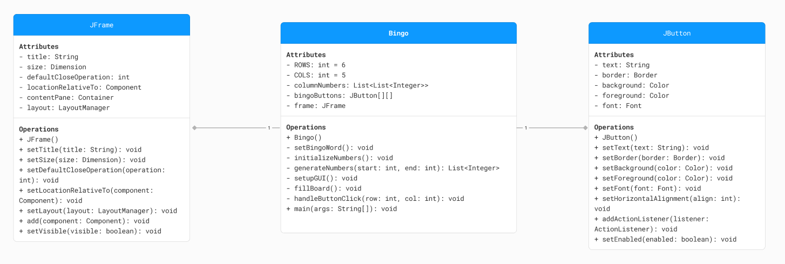

### Bingo Game
An implementation of a Bingo game using Java Swing. Creates Bingo card with numbers arranged in columns B, I, N, G, O. Players are to interact with the Bingo card by selecting numbers, and the buttons are disabled once they are clicked. The game consists of a Bingo class that handles the logic and presentation of the Bingo card.

### Submitted by
Calanuga, Gillie  
Nava, Angelika Marie  
Sarmiento, Reycel  

### Attributes
`columnNumbers` is a list of lists storing numbers for each column in the Bingo card.  
`bingoButtons` is a two-dimensional array of JButtons representing the Bingo card grid.  
`frame` is a JFrame instance used as the main window for the Bingo game.  

### Methods
`Bingo()` is a constructor initializing the Bingo game. It sets up the frame, generates numbers for columns, sets up the GUI, fills the board, sets the BINGO word, and makes the frame visible.  
`setBingoWord()` sets the BINGO word at the top of the Bingo card and marks the central cell as "FREE".  
`initializeNumbers()` generates number ranges for each column and stores them in columnNumbers.  
`generateNumbers(int start, int end)` generates numbers within a specific range for a column and shuffles them.  
`setupGUI()` constructs the graphical user interface for the Bingo card, creating buttons with specific formatting and adding action listeners to handle button clicks.  
`fillBoard()` fills the Bingo card grid with numbers from columnNumbers.  
`handleButtonClick(int row, int col)` disables a button in the Bingo card grid when clicked.  

Bingo UML diagram:
