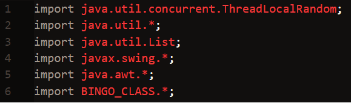
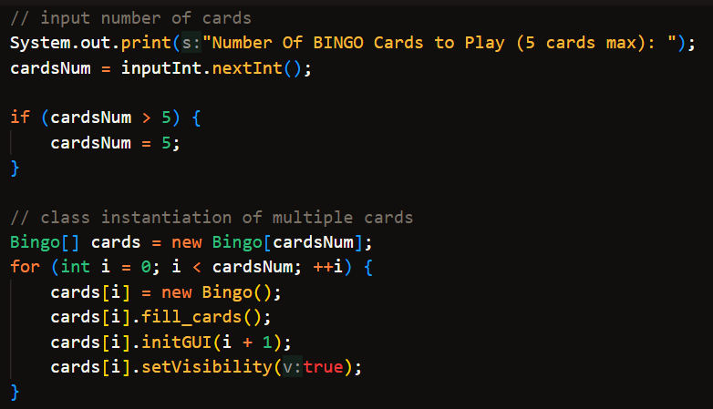
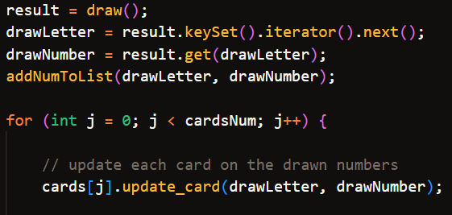
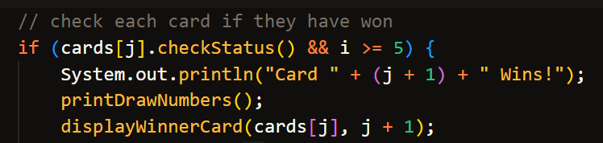
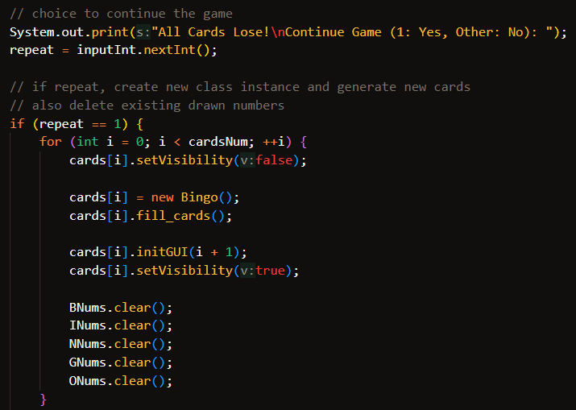
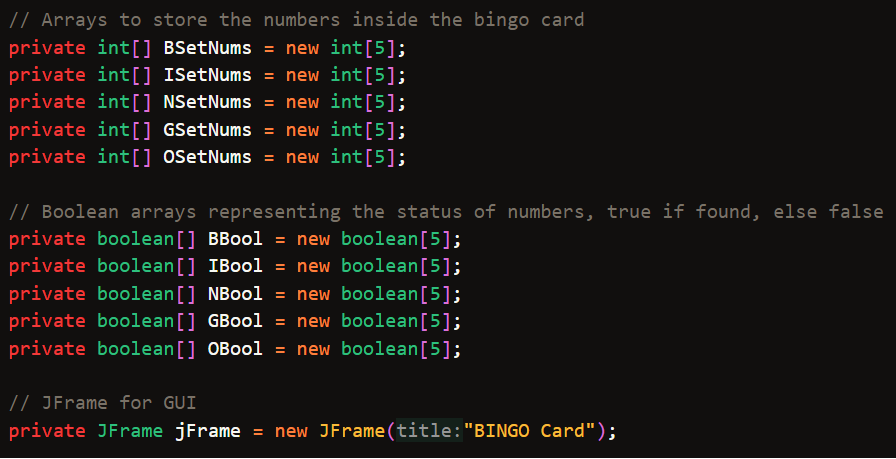
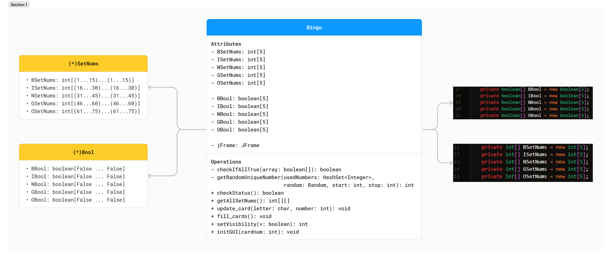

# Bingo Game
> This repository contains source code for playing a Bingo Game, made by Java, and utilized Java Swing for GUI

## Bingo Game Flow:
### Dependencies

### Installation
> `git clone https://github.com/hydraadra112/act6-major-output-bingo.git`

### Main Program:
* The user has the option to input (No. of Cards) how many Bingo cards to use, with maximum of 5 cards only. The input is taken by using a scanner.
* Initialize an Bingo array with size of the same number of inputted number of cards. And created a class instance for each element.
* Each iteration will then call necessary methods to prepare the card.

**Cards Input & Class Instantiation**

* Iterate for 35 draws, with each draw will be saved in their respective lists of `B, I, N, G, O,` and update the current status of the current iteration of Bingo Card.

**Cards Update & Saving of Drawn Numbers**

* Each iteration of the cards will be validated and checked to see if it hits the bingo.
* If bingo hits, it will create another card from that current iteration of card, and displays the numbers that hit the bingo.

**Bingo!**

* If not Bingo, the user will have the choice to continue the game. But it each iteration of cards will instantiate a new class for another card. Or they can also end the game.

**Repeat Program** 

### Bingo Class:
* The attributes of the bingo class. Each letter of BINGO is an array of size 5, both for integer and boolean data types. And `JFrame` attribute for GUI.

**Attributes**

* SetNums arrays are initialized as size 5, supposed to contain values of that specific column letter. 
* Bool arrays are initialiazed also as size 5, with each index is equal to false. It will be used to determine which of the drawn letter and number exists in this card.

**Methods**
* `getAllSetNums()` returns a 2D array, that contains the SetNums collection of BINGO.
* `checkStatus()` returns a boolean, it searches for a winning combination of the card, with the help of bool arrays.
	* This method has a helper method called `checkIfAllTrue()`, which basically checks each element of an boolean array if they are true or not.
* `updateCard()` takes a character and integer input, which represents the drawn letter and number. It will update the specific bool array of BINGO, and then sets the current index into true.
* `fill_cards()` It fills the empty BINGO SetNums by random numbers, with specific ranges for each letter.
	* This method uses a helper method called `getRandomUniqueNumber()` which basically creates a number, checks if it already exists in the bingo card, generate again if it exists, else, continue.
* `setVisibility()` this method basically lets you set the visibility of the BINGO card. 
* `initGUI()` initializes the GUI of the current BINGO card. It layouts a new card by using JFrame, and adds the numbers of SetNums, and added extra dynamics that buttons can change colors once clicked.

**Bingo UML Diagram**

